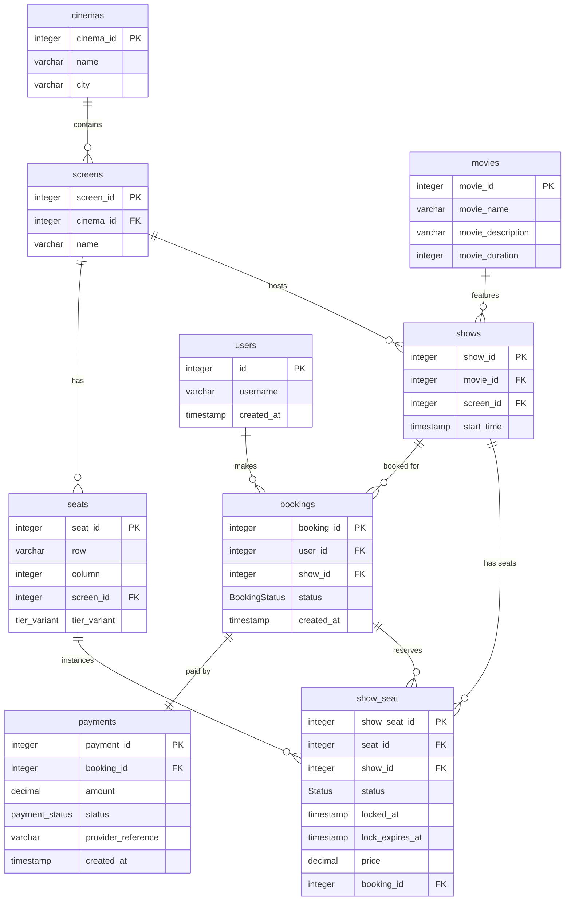

# Database Schema Documentation

This directory contains the technical details of the database schema.

## Entity Relationship Diagram

The following diagram illustrates the relationships between the core entities: **Cinemas**, **Screens**, **Movies**, **Shows**, **Seats**, **Bookings**, and **Payments**.

## Table Descriptions

### Key Entities

- **cinemas**: Represents physical theater locations.
- **screens**: Individual halls within a cinema.
- **movies**: Film metadata.
- **shows**: Specific instances of a movie playing on a screen at a time.
- **seats**: Physical seats in a screen (static configuration).

### Booking Flow Entities

- **users**: Registered customers.
- **show_seat**: The dynamic inventory table. Links a `seat` to a `show` and tracks its availability status (`Unlocked`, `Locked`, `Booked`).
- **bookings**: Represents a user's intent to reserve seats.
- **payments**: Records financial transactions for bookings.

## Enums

- **Status**: `Unlocked`, `Locked`, `Booked` (Used in `show_seat`).
- **BookingStatus**: `Created`, `Confirmed`, `Expired`, `Cancelled`.
- **payment_status**: `Pending`, `Success`, `Failed`.
- **tier_variant**: `VIP`, `Premium`, `Regular`.

## DBML Definition

The raw DBML definition is available in [schema.dbml](./schema.dbml). You can copy the content of that file and paste it into [dbdiagram.io](https://dbdiagram.io) for an interactive view.
